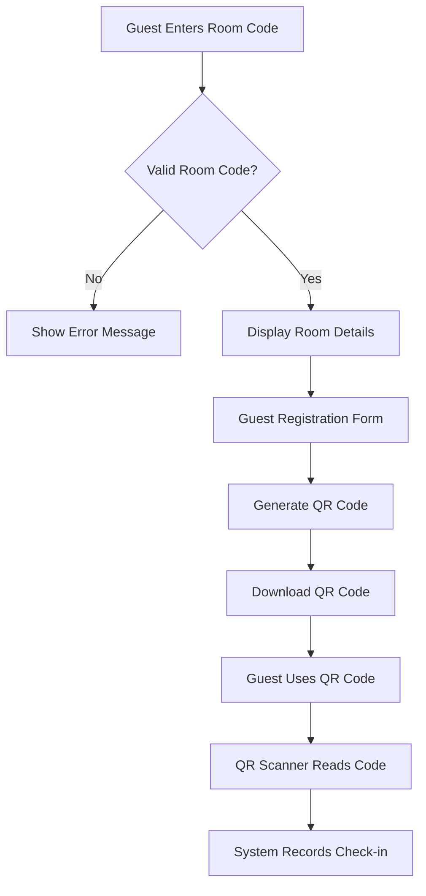
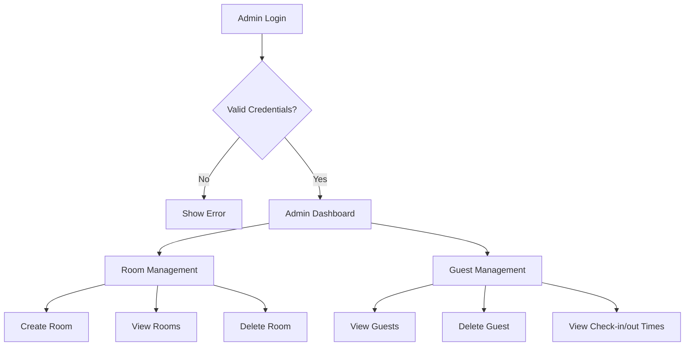
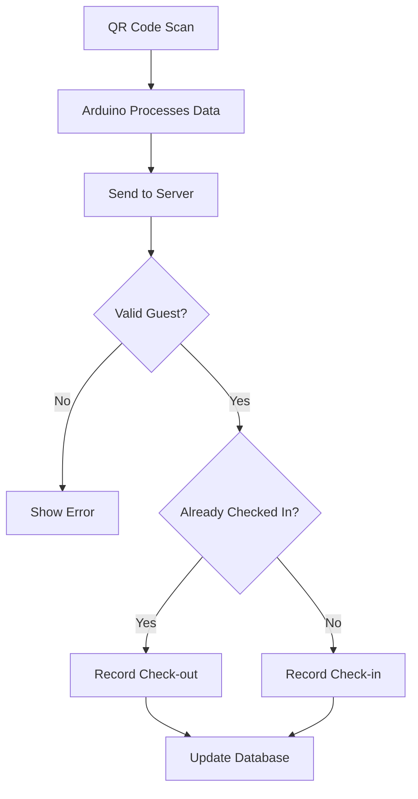
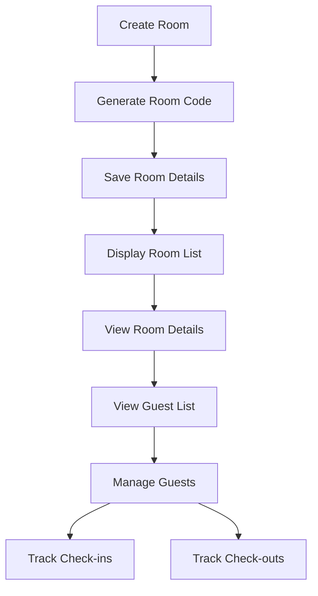
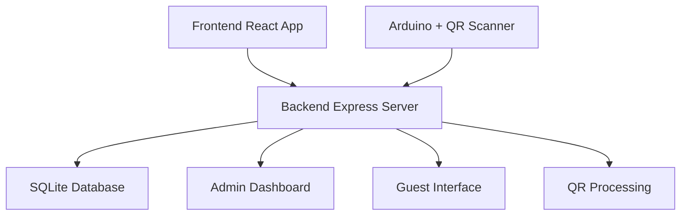
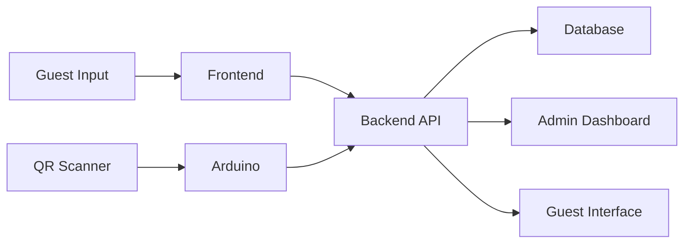

# System Flowchart

## Guest Registration and Check-in Flow

```mermaid
graph TD
    A[Guest Enters Room Code] --> B{Valid Room Code?}
    B -->|No| C[Show Error Message]
    B -->|Yes| D[Display Room Details]
    D --> E[Guest Registration Form]
    E --> F[Generate QR Code]
    F --> G[Download QR Code]
    G --> H[Guest Uses QR Code]
    H --> I[QR Scanner Reads Code]
    I --> J[System Records Check-in]
```

## Admin Management Flow

```mermaid
graph TD
    A[Admin Login] --> B{Valid Credentials?}
    B -->|No| C[Show Error]
    B -->|Yes| D[Admin Dashboard]
    D --> E[Room Management]
    D --> F[Guest Management]
    E --> G[Create Room]
    E --> H[View Rooms]
    E --> I[Delete Room]
    F --> J[View Guests]
    F --> K[Delete Guest]
    F --> L[View Check-in/out Times]
```

## QR Code Scanning Flow

```mermaid
graph TD
    A[QR Code Scan] --> B[Arduino Processes Data]
    B --> C[Send to Server]
    C --> D{Valid Guest?}
    D -->|No| E[Show Error]
    D -->|Yes| F{Already Checked In?}
    F -->|Yes| G[Record Check-out]
    F -->|No| H[Record Check-in]
    G --> I[Update Database]
    H --> I
```

## Room Management Flow

```mermaid
graph TD
    A[Create Room] --> B[Generate Room Code]
    B --> C[Save Room Details]
    C --> D[Display Room List]
    D --> E[View Room Details]
    E --> F[View Guest List]
    F --> G[Manage Guests]
    G --> H[Track Check-ins]
    G --> I[Track Check-outs]
```

## System Architecture

```mermaid
graph TD
    A[Frontend React App] --> B[Backend Express Server]
    B --> C[SQLite Database]
    D[Arduino + QR Scanner] --> B
    B --> E[Admin Dashboard]
    B --> F[Guest Interface]
    B --> G[QR Processing]
```

## Data Flow

```mermaid
graph LR
    A[Guest Input] --> B[Frontend]
    B --> C[Backend API]
    C --> D[Database]
    E[QR Scanner] --> F[Arduino]
    F --> C
    C --> G[Admin Dashboard]
    C --> H[Guest Interface]
```
